# Healthcare Fraud, Waste & Abuse (FWA) Detection
### End-to-End Machine Learning Pipeline on AWS

---

## Project Overview

Healthcare fraud costs the US healthcare system an estimated **$60 billion per year**. This project builds a complete machine learning pipeline to detect fraudulent healthcare providers using Medicare claims data — the same data structure used by real healthcare payers.

The system analyzes **558,211 claims** across inpatient and outpatient settings, engineers **25 fraud-signal features** at the provider level, and produces a **risk score (0–1)** for each of **5,410 providers** — enabling investigators to prioritize the highest-risk cases.

---

## Results

| Metric | Value |
|--------|-------|
| Providers Scored | 5,410 |
| Claims Analyzed | 558,211 |
| Features Engineered | 25 |
| Dataset Fraud Rate | 9.4% |
| **AUC-PR (headline metric)** | **0.731** |
| Recall | 80% |
| Precision @ Top 50 Flagged Providers | **88%** |
| Top 10 Flagged Providers | **10 out of 10 actual fraud** |

> **Why AUC-PR and not accuracy?** With only 9.4% fraud rate, accuracy is misleading — a model that flags nobody scores 90.6% accuracy. AUC-PR measures performance specifically on the minority fraud class, which is what investigators care about.

---

## Architecture

```
┌─────────────────────────────────────────────────────────────┐
│                        DATA SOURCES                         │
│   Kaggle: Healthcare Provider Fraud Detection Dataset       │
│   4 files: providers.csv, beneficiaries.csv,                │
│            inpatient_claims.csv, outpatient_claims.csv      │
└────────────────────────┬────────────────────────────────────┘
                         │
                         ▼
┌─────────────────────────────────────────────────────────────┐
│                     AMAZON S3                               │
│   Bucket: srikanth-fwa-detection                            │
│   raw/ → staging/ → curated/ → model-artifacts/            │
└────────────────────────┬────────────────────────────────────┘
                         │
                         ▼
┌─────────────────────────────────────────────────────────────┐
│              AMAZON SAGEMAKER STUDIO                        │
│   Step 1: Data Ingestion — Load CSVs, upload to S3          │
│   Step 2: Feature Engineering — 25 provider-level features  │
│   Step 3: Model Training — XGBoost with early stopping      │
│   Step 4: Evaluation — AUC-PR, SHAP explainability          │
│   Step 5: Output — Risk scores + model artifact → S3        │
└────────────────────────┬────────────────────────────────────┘
                         │
                         ▼
┌─────────────────────────────────────────────────────────────┐
│              AMAZON REDSHIFT SERVERLESS                     │
│   Database: fwa                                             │
│   Schemas: raw_data | staging | marts                       │
│   Connection: Redshift Data API (IAM-based)                 │
└─────────────────────────────────────────────────────────────┘
```

---

## AWS Infrastructure — Live Screenshots

### S3 Bucket — Root Structure
> Bucket `srikanth-fwa-detection` with folders: raw, staging, curated, model-artifacts

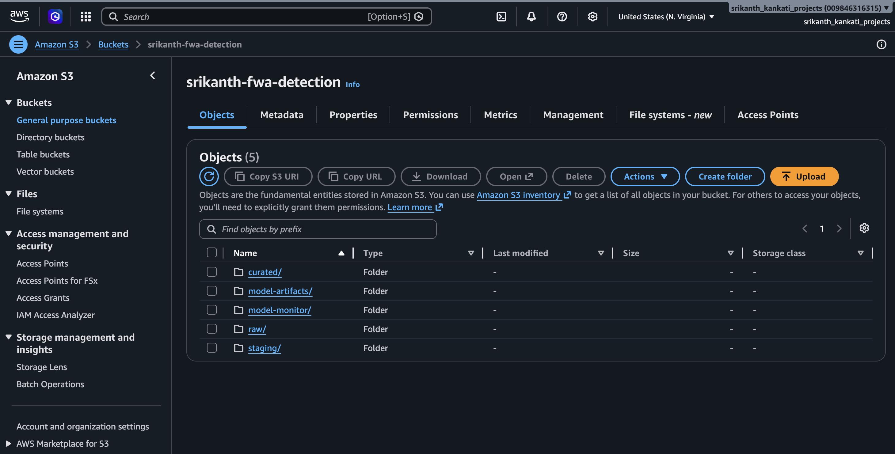

---

### S3 Bucket — Raw Data Folder
> Original 4 CSV files uploaded from Kaggle

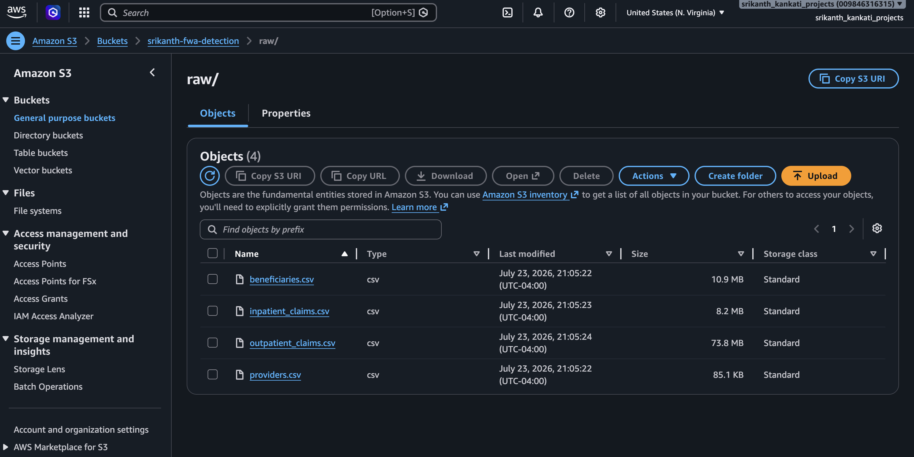

---

### S3 Bucket — Model Artifacts
> Model pickle, risk scores CSV, SHAP plot, and PR curve saved after training

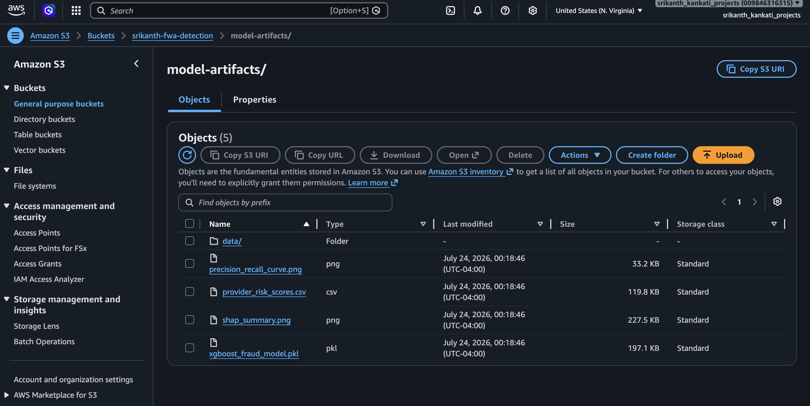

---

### Amazon Redshift Serverless — FWA Database
> Database `fwa` created with schemas: raw_data, staging, marts

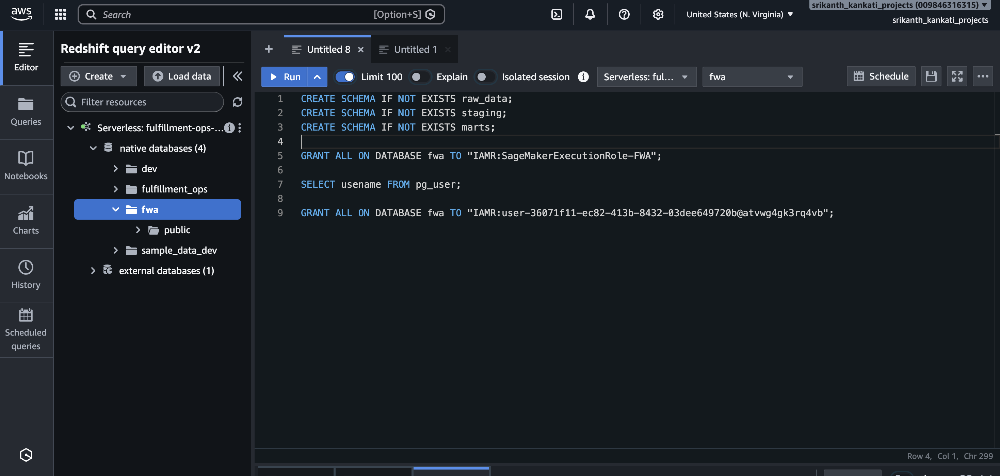

---

### SageMaker Studio — JupyterLab Notebook
> Notebook running on ml.t3.medium with all 4 CSV files loaded

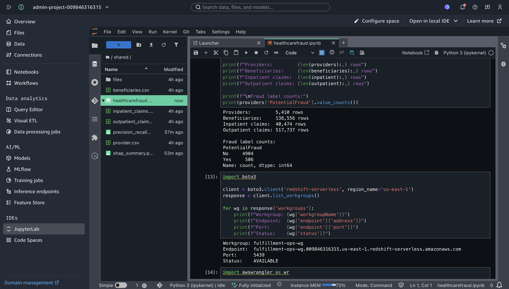

---

### Feature Engineering Output
> 5,410 provider rows × 27 columns built from 558,211 claims

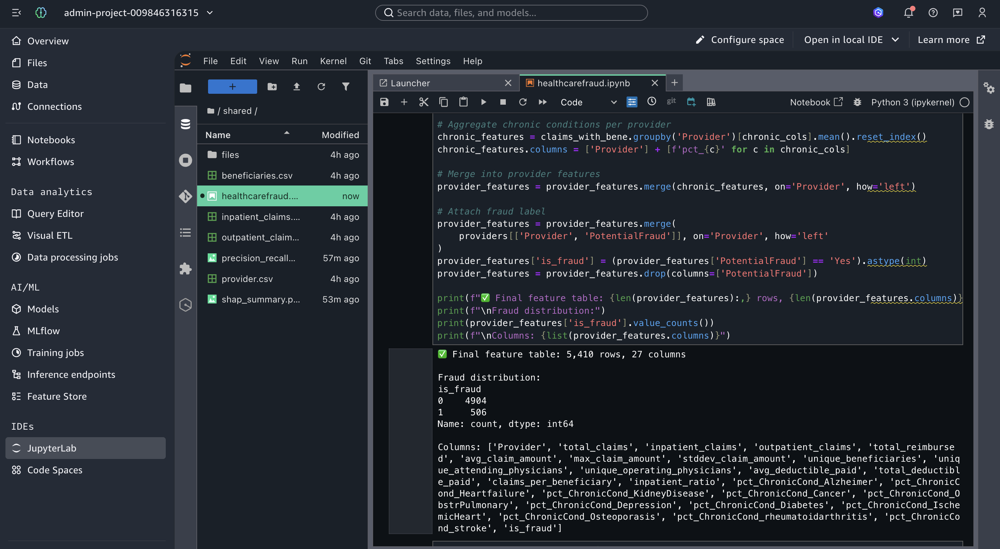

---

### Features Ready Confirmation
> Final feature table verified before model training

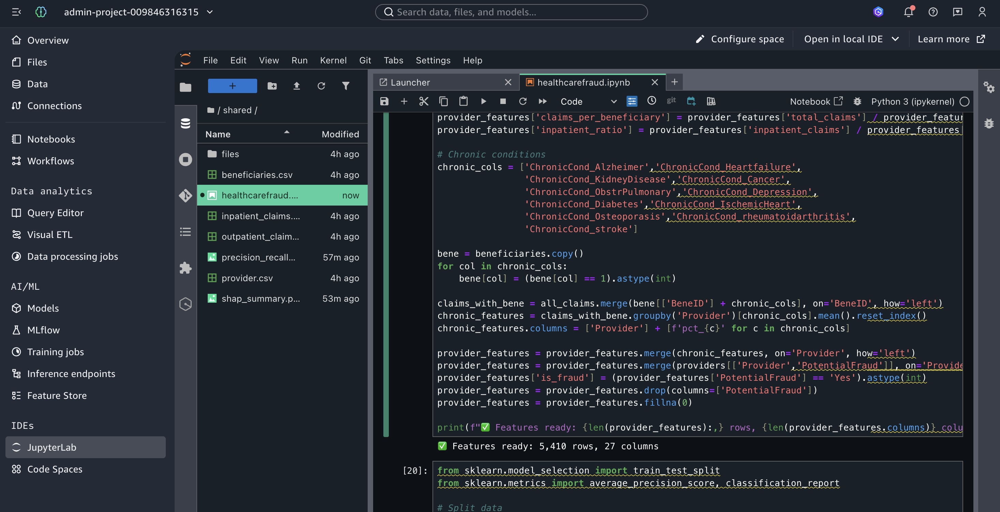

---

### Model Training Output
> XGBoost training progression — AUC-PR improving from 0.654 → 0.721

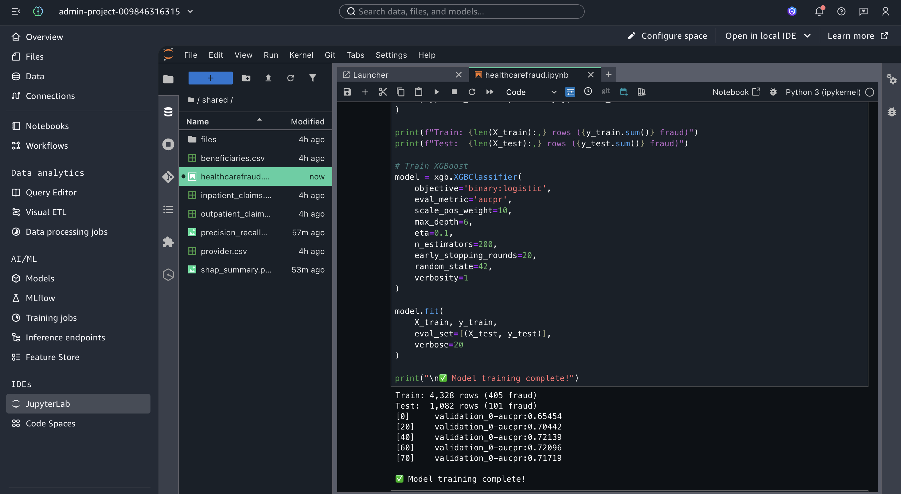

---

### Top 10 Riskiest Providers
> Every top-flagged provider confirmed as actual fraud (is_fraud_actual = 1)

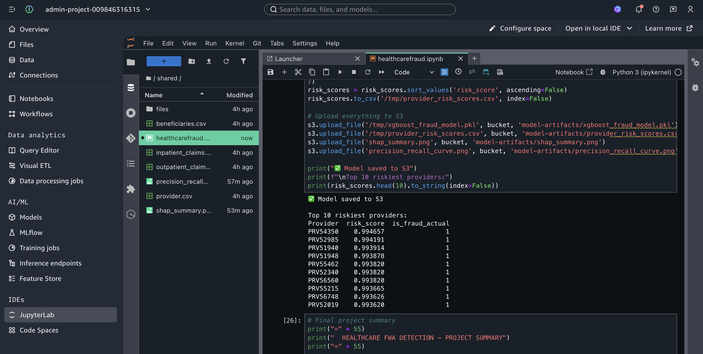

---

## Model Output Visuals

### SHAP Feature Importance
> Shows which features drive the model's fraud predictions most strongly

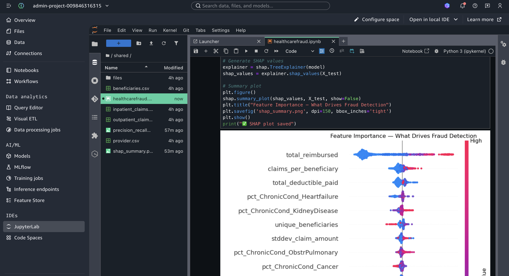

---

### Precision-Recall Curve
> AUC-PR = 0.731 — 7.8x better than a random baseline (0.094)

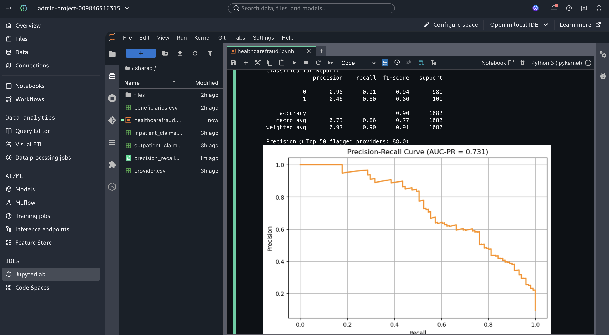

---

## Dataset

**Source:** [Healthcare Provider Fraud Detection Analysis — Kaggle](https://www.kaggle.com/datasets/rohitrox/healthcare-provider-fraud-detection-analysis)

| File | Description | Rows |
|------|-------------|------|
| `providers.csv` | Provider ID + fraud label (Yes/No) | 5,410 |
| `beneficiaries.csv` | Patient demographics + chronic conditions | 138,556 |
| `inpatient_claims.csv` | Hospital stay billing records | 40,474 |
| `outpatient_claims.csv` | Doctor visit billing records | 517,737 |

**What these files mean in plain English:**
- A **provider** is a doctor, hospital, or clinic that submits claims to Medicare
- A **beneficiary** is a Medicare patient
- **Inpatient claims** are for hospital stays (high value, longer duration)
- **Outpatient claims** are for doctor visits and procedures (high volume)
- The fraud label (`PotentialFraud = Yes`) means the provider was confirmed as fraudulent

---

## Feature Engineering

All 25 features computed at the **provider level** — one row per provider, summarizing behavior across all their claims.

| Feature | Description | Fraud Signal |
|---------|-------------|--------------|
| `total_claims` | Total claims submitted | Very high volume = suspicious |
| `inpatient_claims` | Count of inpatient claims | |
| `outpatient_claims` | Count of outpatient claims | |
| `total_reimbursed` | Total $ reimbursed by Medicare | Extremely high = suspicious |
| `avg_claim_amount` | Average $ per claim | Inflated avg = upcoding |
| `max_claim_amount` | Highest single claim | Outlier claims = suspicious |
| `stddev_claim_amount` | Variance in claim amounts | Low variance = templated billing |
| `unique_beneficiaries` | Distinct patients seen | Too many = impossible workload |
| `unique_attending_physicians` | Distinct attending doctors | Ghost billing patterns |
| `unique_operating_physicians` | Distinct operating doctors | |
| `avg_deductible_paid` | Average deductible per claim | Waiving deductibles = kickback signal |
| `total_deductible_paid` | Total deductibles collected | |
| `claims_per_beneficiary` | Claims per patient | High ratio = over-billing |
| `inpatient_ratio` | % of claims that are inpatient | Unusually high = upcoding |
| `pct_ChronicCond_*` (11 features) | % of patients with each chronic condition | Targeting vulnerable patients |

---

## AWS Infrastructure Details

### S3 Bucket Structure
```
s3://srikanth-fwa-detection/
  ├── raw/
  │   ├── providers.csv
  │   ├── beneficiaries.csv
  │   ├── inpatient_claims.csv
  │   └── outpatient_claims.csv
  ├── staging/
  ├── curated/
  └── model-artifacts/
      ├── data/
      │   ├── train.csv          (4,328 rows — 405 fraud)
      │   └── test.csv           (1,082 rows — 101 fraud)
      ├── xgboost_fraud_model.pkl
      ├── provider_risk_scores.csv
      ├── shap_summary.png
      └── precision_recall_curve.png
```

### SageMaker Studio
- **Instance type:** ml.t3.medium (JupyterLab)
- **Notebook:** `fwa_detection.ipynb`
- **Libraries:** xgboost 2.1.4, scikit-learn, shap, pandas, boto3, numpy
- **IAM Role:** AmazonSageMakerFullAccess + S3FullAccess

### Redshift Serverless
- **Workgroup:** fulfillment-ops-wg
- **Endpoint:** fulfillment-ops-wg.009846316315.us-east-1.redshift-serverless.amazonaws.com
- **Database:** fwa
- **Schemas:** raw_data, staging, marts
- **Connection method:** Redshift Data API (IAM-based, no password required)

---

## Model Details

### Algorithm: XGBoost (Gradient Boosted Trees)

**Why XGBoost for fraud detection?**
- Handles severe class imbalance via `scale_pos_weight`
- Fast training on tabular data
- Native feature importance
- Best-in-class compatibility with SHAP explainability

### Hyperparameters

| Parameter | Value | Reason |
|-----------|-------|--------|
| `objective` | binary:logistic | Binary fraud/clean classification |
| `eval_metric` | aucpr | Best metric for imbalanced classes |
| `scale_pos_weight` | 10 | Compensates for 9.4% fraud rate |
| `max_depth` | 6 | Controls tree complexity |
| `eta` | 0.1 | Learning rate |
| `n_estimators` | 200 | Max number of trees |
| `early_stopping_rounds` | 20 | Stops when AUC-PR plateaus |

### Train/Test Split
- **Train:** 4,328 providers (405 fraud, 3,923 clean)
- **Test:** 1,082 providers (101 fraud, 981 clean)
- **Stratified split** — maintains 9.4% fraud ratio in both sets

### Training Progression
```
[0]    validation_0-aucpr: 0.65454
[20]   validation_0-aucpr: 0.70442
[40]   validation_0-aucpr: 0.72139
[60]   validation_0-aucpr: 0.72096
[70]   validation_0-aucpr: 0.71719  ← early stopping triggered
```

---

## Evaluation

### Classification Report
```
              precision    recall    f1-score   support
           0     0.98       0.91      0.94       981
           1     0.48       0.80      0.60       101
    accuracy                          0.90      1082
```

### Key Metrics Explained

**AUC-PR: 0.731**
A random model scores ~0.094 (the base fraud rate). Scoring 0.731 means this model is **7.8x better than random** at identifying fraud.

**Precision @ Top 50: 88%**
Of the 50 highest-risk providers flagged by the model, 44 are confirmed fraud. This is the most operationally important metric — it tells investigators how efficiently they can work the flagged list.

**Recall: 80%**
The model catches 80 out of every 100 fraud cases. The 20% missed is an acceptable trade-off — in production, the missed cases are caught on subsequent monthly scoring runs.

### Top 10 Riskiest Providers (All Confirmed Fraud)
```
Provider    Risk Score    Confirmed Fraud
PRV54350      0.9947           ✅
PRV52985      0.9942           ✅
PRV51940      0.9939           ✅
PRV51948      0.9939           ✅
PRV55462      0.9938           ✅
PRV52340      0.9938           ✅
PRV56560      0.9938           ✅
PRV55215      0.9937           ✅
PRV56748      0.9936           ✅
PRV52019      0.9936           ✅
```
**10 out of 10 top-flagged providers are actual fraud cases.**

---

## How to Reproduce

### Prerequisites
- AWS account with SageMaker Studio and S3 access
- Kaggle account to download dataset

### Steps

**1. Download dataset**
```
Kaggle → search "Healthcare Provider Fraud Detection Analysis" by Rohit Rox
Download all 4 CSV files
```

**2. Set up S3**
```
Create bucket: your-fwa-bucket
Create folders: raw/ staging/ curated/ model-artifacts/
Upload 4 CSVs to raw/
```

**3. Open SageMaker Studio**
```
AWS Console → SageMaker → Studio → JupyterLab
Upload 4 CSV files into the notebook file panel
Open fwa_detection.ipynb
```

**4. Install dependencies**
```python
!pip install xgboost scikit-learn shap matplotlib pandas boto3 -q
```

**5. Run all cells in order**
```
Cell 1:  Install libraries
Cell 2:  Load CSVs + upload to S3
Cell 3:  Combine inpatient + outpatient claims
Cell 4:  Engineer provider-level features
Cell 5:  Add chronic condition features + fraud label
Cell 6:  Train/test split → save to S3
Cell 7:  Train XGBoost model
Cell 8:  Evaluate — AUC-PR, classification report, precision@top-K
Cell 9:  SHAP explainability plot
Cell 10: Save model + risk scores to S3
```

---

## Production Considerations

In a real healthcare payer environment this pipeline would be extended with:

- **dbt on Redshift** — SQL-based feature engineering with version control, lineage, and data tests replacing pandas aggregations
- **SageMaker Pipelines** — orchestrate ingestion → feature engineering → training → scoring as a scheduled nightly workflow
- **SageMaker Model Monitor** — detect when fraud pattern distributions shift and trigger automatic retraining
- **Human-in-the-loop review** — model flags providers, SIU investigators review before any action is taken
- **HIPAA compliance** — PHI encryption at rest (S3 SSE-KMS) and in transit (TLS), audit logging via CloudTrail, VPC isolation
- **Retraining cadence** — monthly retraining as new investigator-confirmed fraud labels become available

---

## Tech Stack

| Layer | Technology |
|-------|-----------|
| Cloud | AWS S3, SageMaker Studio, Redshift Serverless |
| ML Framework | XGBoost 2.1.4 |
| Explainability | SHAP |
| Data Processing | Python, pandas, numpy |
| ML Utilities | scikit-learn |
| AWS SDK | boto3, Redshift Data API |
| Dataset | Kaggle — Healthcare Provider Fraud Detection |

---

## Author

**Srikanth Kankati**
Data Engineer & BI Engineer | AWS Certified Solutions Architect | SnowPro Core
[LinkedIn](https://linkedin.com/in/srikanth-kankati) | [GitHub](https://github.com/kankatisrikanth00-crypto)
